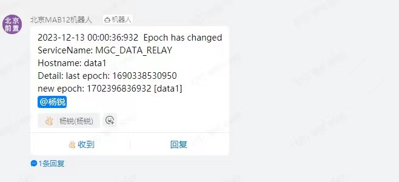

## 问题背景
2023-12-13 凌晨，生产环境 data1 机器的微网前置发出了下图的告警信息：
  
这代表前置程序中的重复上线模块在 redis 中的续期失效，并以新的`epoch`重新开启续期。在这之后，部分控制器出现了**链路在线，但云端显示不在线**的异常现象。  
这引出了两个问题：  
1. 控制器的异常现象怎么产生的？
2. 重复上线模块为何在 redis 中续期失效？

以及一个最终问题：  
**如何解决？**

## 问题分析
### 1. 控制器的异常现象怎么产生的？
分析前置上线日志`login.log`和控制器报文日志，还原事件全过程：  
1. redis 续期失效，前置在 redis 中使用新`epoch`重新续期。  
   此时前置**对所有当前在线控制器的重复上线校验失效**。
2. 网络波动，在线控制器 mgc_1 判断自身链路断开，尝试使用新链路登陆前置。  
   此时前置还未感知到 mgc_1 离网（暂未心跳超时），离线通知未发，理论上控制器应无法登陆。  
   但由于`epoch`变更导致对 mgc_1 的重复登陆检验失效，mgc_1 可以登陆。
3. mgc_1 使用新链路成功登陆前置。  
   此时对于 mgc_1 来说，老链路已被释放，不再维护，仅当前一条链路（新链路）有效。  
   但于前置来说，老链路暂未被释放（暂未心跳超时），新链路成功登陆则意味着：有两条链路对应了同一台控制器 -- mgc_1。
4. mgc_1 链路在线，但前置判断 mgc_1 离线并发送离线通知。  
   实际被前置判断离线的是 mgc_1 的老链路，但因新/老链路均对应了 mgc_1，因此离线通知会直接将 mgc_1 置为离线状态，虽然此时新链路仍处于在线状态。

### 2. 重复上线模块为何在 redis 中续期失效？
分析 data1 机器日志`/var/log/messages`发现，异常发生前后，机器上的 influxdb 容器内存占用激增，曾一度将机器内存资源打满。这导致前置程序在一定时间内拿不到足够内存资源，执行变慢，无法及时对 redis 中的 key 进行续期，最终导致续期失效。

## 解决方法
redis 续期失效的问题，是由机器环境导致的，不是前置程序能够解决的。  
本问题的根源在于：前置对当前在线控制器的重复上线校验失效。  
而 redis 续期失效，之所以会导致前置对当前在线控制器的重复上线校验失效，核心点在于`epoch`发生了变更。这会让重复校验逻辑认为：当前前置已经发生过重启，所有连接的控制器理应全部离线。  
实际经过梳理后发现，当且仅当前置重启的场景，`epoch`才需发生变更。而对于 redis 续期失效的场景，前置仅需重新续期原`epoch`即可。  
基于上述结论，做出代码变更如下：  
https://e.gitee.com/njderi/repos/njderi/jcrj-utils/commit/16608ea5473837267af333dab8627cf453127cd5

附件：[重复上线场景梳理](./上线场景.drawio)